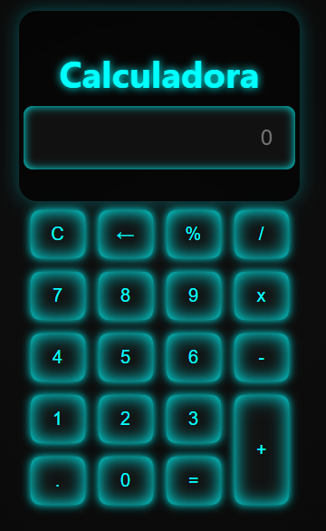

# 🧮 Calculadora Web

Este projeto é uma calculadora simples criada com **HTML**, **CSS** e **JavaScript**, com suporte tanto para cliques nos botões quanto para entrada via teclado. Ela permite realizar operações básicas como soma, subtração, multiplicação, divisão e porcentagem.

## ✨ Funcionalidades

- Interface moderna e responsiva
- Operações básicas:
  - Adição
  - Subtração
  - Multiplicação
  - Divisão
  - Porcentagem
- Entrada de números:
  - Via cliques nos botões
  - Via teclado (números, operações, Enter, Backspace, etc.)
- Tecla `C` para limpar
- Tecla `←` para apagar último dígito

## 💻 Tecnologias utilizadas

- **HTML5** — estrutura da calculadora
- **CSS3** — estilo com gradiente, sombras e efeito neon
- **JavaScript** — lógica da calculadora e manipulação do DOM

## 📷 Preview



## 🚀 Como usar

1. Clone o repositório:
    ```bash
    git clone https://github.com/Fagner-Lopes-Paiva/calculadora.git
    ```
